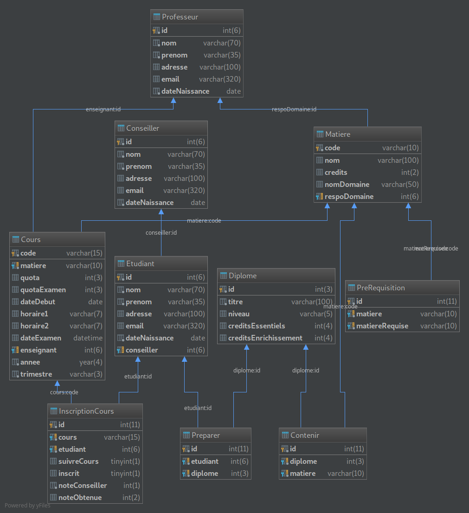

# Conception

## Modèle Entité/Association

**Trimestre :** Cette entité correspond à une période scolaire identifiée par une clé composée de 2 attributs : *année* + *période*. La période est l'une des trois : l'automne, le prinstemps ou l'été, il est possible d'associer une valeur numérique où un code à chaque période afin de minimiser la taille de stockage. Un trimestre est décrit par sa date de début et sa date de fin.

**Cours :** L'entité cours représente une instance concrète d'une *Matière*.
Elle est identifié par la clé unique *idCours* et contient les attributs *quota* et *dateExamen*.

**Professeur :** Un professeur a un identifiant unique (*idProfesseur*) et ses informations de contact en tant qu'attributs.

**Domaine :** Un domaine est identifié par son nom car il est forcément unique (logiquement, si les domaines sont bien appelés ils portent des noms distinctes).

**Matière :** L'entité *Matière* a un identifiant unique et un certain nombre de *crédits*.

**Diplôme :** Un diplôme est identifié par la clé *idDiplome* et est caractérisé par les attributs *titreDiplome*, *creditsEssentiels*, et *creditsEnrichissement*.

**Etudiant :** Identifié par la clé *idEtudiant* et caractérisé par ses information de contact.

**Conseiller :** Identifié par la clé *idConseiller* et caractérisé par ses information de contact.

\newpage
## Les relations entre les entités
**Relations binaires**

**Se dérouler pendant :** Un cours se déroule pendant un trimestre définitivement, plusieurs cours se déroule pendant un trimestre.

**Enseigner :** Un cours est enseigné par un professeur, un professeur peut enseigné plusieurs cours. Il est possible qu'un professeur n'enseigne pas des cours s'il est responsable académique.

**Spécialiser :** Un professeur est spécialisé dans un ou plusieurs domaines, dans un domaine spécifique il y a un ou plusieurs professeurs spécialisés.

**Être responsable :** Un professeur peut être le responsable académique dans un de ces domaines de spécialité, le domaine a un professeur comme responsable académique.

**Appartenir :** Une matière appartient a un domaine académique, et un domaine contient au moins une matière.

**Prérequire :** Une matière peut avoir une ou plusieurs matières prérequises, et une matière peut être prérequise par une ou plusieure matières.

**Être instance de :** Un cours est une instance d'une maitère sur un trimestre, une matière peut être instanciée plusieurs par plusieurs cours.

**Suivre :** Un étudiant suit un ou plusieurs cours et obtient une note dans chaque cours. Un cours peut être est suivi par un ou plusieurs étudiants.

**Se préinscrire :** Un ou plusieurs étudiants se pré-inscrivent dans un cours, et en fonction d'une note de priorité en respectant le quota du cours un ou plusieurs étudiants suivent le cours. La liste de pré-inscrits peut contenir un ou plusieurs étudiants, s'il n'y a pas de pré-inscrits le cours ne s'ouvre pas.

**Donner conseils :** Un conseiller donne des conseils à un ou plusieurs étudiants concernant leur choix des matières, chaque étudiant est prend des conseils d'un conseiller.

**Relation ternaire**

**Préparer :**

  - Une matière appartient à un ou plusieurs ou aucun programme diplômant, et un programme contient une ou plusieurs matière. (Dans le sens défini en Section 1.2)
  - Un étudiant prépare un ou plusieurs ou aucun diplôme, un diplôme peut être préparé par un ou plusieurs étudiants.
  - Un étudiant prépare une ou plusieurs matières, et une matière est préparé par un ou plusieurs ou aucun étudiant.

## Schéma relationnel

On passe aux schéma relationnel à partir de notre modèle Entité/Association.

### Entités
- Trimestre(**année**, **periode**, dateDebut, dateFin)
- Cours(**idCours**, quota, dateExamen)
- Professeur(**idProfesseur**, nomProf, prenomProf, adresseProf, emailProf)
- Domaine(**nomDomaine**)
- Matière(**codeMatière**, crédits)
- Etudiant(**idEtudiant**, nomEtudiant, prenomEtudiant, adresseEtudiant, emailEtudiant)
- Conseiller(**idConseiller**, nomConseiller, prenomConseiller, adresseConseiller, emailConseiller)
- Diplome(**idDiplome**, titreDiplome, creditsEssentiels, creditsEnrichissement)

### Associations

**Associations binaires 1..n**

- Cours(**idCours**, quota, dateExamen, codeMatiere, annee, periode, idProfesseur)
- Domaine(**nomDomaine**, idProfRespo)
- Matiere(**codeMatiere**, crédits, nomDomaine)
- Etudiant(**idEtudiant**, nomEtudiant, prenomEtudiant, adresseEtudiant, emailEtudiant, idConseiller)

**Associations binaires n..n**

- Specialiser(**idProfesseur**, **nomDomaine**)
- Prerequire(**codeMatiere**, **codePrerequise**)
- SePreinscrire(**idCours**, **idEtudiant**)
- Suivre(**idCours**, **idEtudiant**)

**Association ternaire**

- Preparer(**idEtudiant**, **codeMatiere**, **Diplome**)

### Dénormalisation
- La relation **Trimestre** peut être supprimée en la déplaçant vers la relation **Cours** car elle porte peu d'attributs et elle résulte d'une entité faible.
- La relation **Domaine** peut être supprimée facilement en la déplaçant vers les relations **Professeur** et **Cours**.

On est tempté de supprimer la relation **Conseiller** car elle est une entité faible et n'est reliée qu'à l'entité **Etudiant**. Néanmoins, il est très important d'avoir un tableau existant dans la base de donnée pour les personnes (Etudiants, Professeurs, Conseillers) sans avoir à faire des requêtes pour obtenir tel liste, je fais donc le choix de garder cette relation.

### Modification sur le pré-rapport
Quand j'ai commencé la deuxième partie du projet, j'ai reconsidéré les choix que j'avais effectué,
j'expliquerais brièvement les changements que j'ai effectué:

- Dans la dénormalisation, j'avais supprimé la relation **Matiere** car elle est instanciée par la relation **Cours**,
finalement j'ai préféré la garder afin de distinguer ces deux relations et de rendre les tableaux plus lisibles.
- Pour simplifier, j'ai renommé les entités qui portent des noms comme *prenomConseiller* en *prenom*.
- J'ai fusionné les deux relations **Préinscription** et **Suivre** dans la relation **InscriptionCours**
qui fait l'affaire.
- J'ai remplacé l'association ternaire par deux associations binaires plus simples,
car on n'utilise jamais les deux relations dans la même requête.
En effet, la relation ternaire était un peu forcée.

## Schéma relationnel final

- Cours(**code**, matiere, quota, quotaExamen, dateDebut, dateExamen, enseignant, annee, periode)
- Professeur(**id**, nom, prenom, adresse, email, dateNaissance)
- Etudiant(**id**, nom, prenom, adresse, email, dateNaissance, idConseiller)
- Conseiller(**id**, nom, prenom, adresse, email, dateNaissance)
- Diplome(**id**, titre, niveau, creditsEssentiels, creditsEnrichissement)
- PreRequisition(**matiere**, matiereRequise)
- InscriptionCours(**cours**, **etudiant**, suivreCours, inscrit, noteConseiller, noteObtenue)
- Preparer(**etudiant**, **diplome**)
- Contenir(**diplome**, **matiere**)

